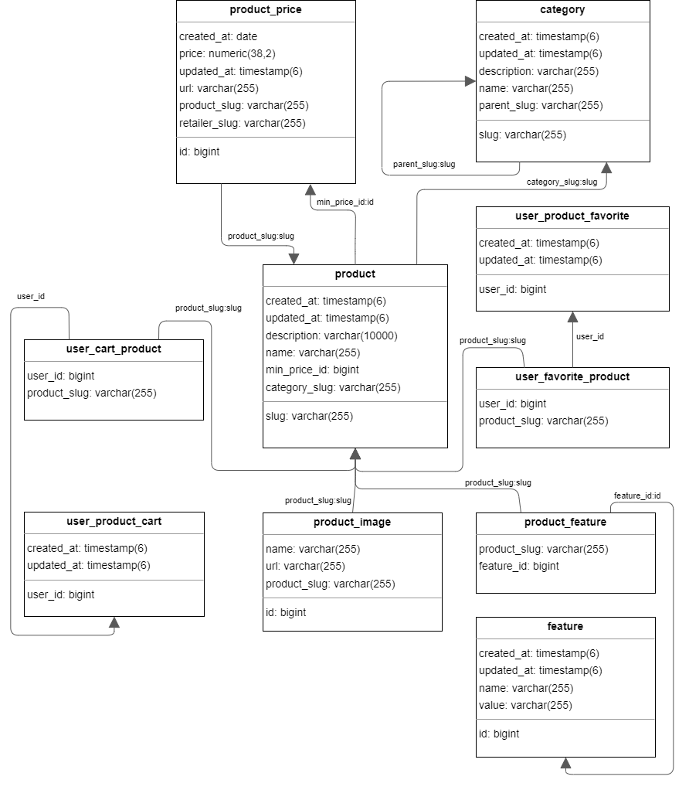

# PriceHunt - search for the best prices for goods

***
A web service for finding the best prices for goods in different online stores that provides users with convenient tools
for comparing prices and terms of purchase.
***

## Stack:

***

* Spring: Cloud, Config, Eureka, Admin, Boot, Data, Gateway
* Hibernate, JPA, PostgreSQL
* Apache Kafka & REST
* Grafana, Prometheus
* Utils: Lombok, Docker, Docker-compose

***

## Microservices:

***

* Auth (JWT with roles and token revoke feature)
* Assortment (Service with main business logic)
* Config (Spring Cloud Config Server)
* Pleerru-producer (Pleer.ru market parser)
* Discovery (Eureka Server Service)

***

## Architecture:
***

***

## Databases:
***
### Assortment Database
***

***
### Auth Database
***

***
### Retailer Database
***

***
### Pleer Database
***

***
